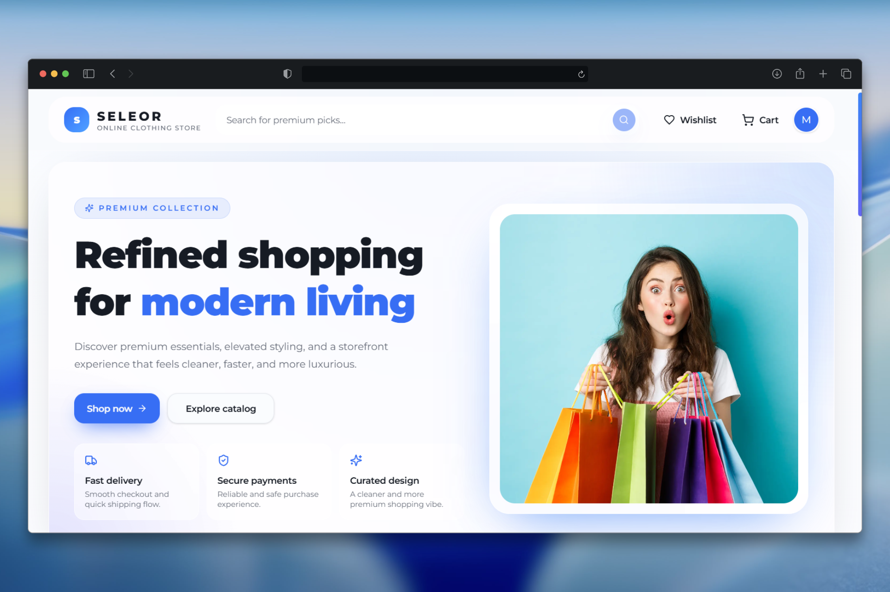
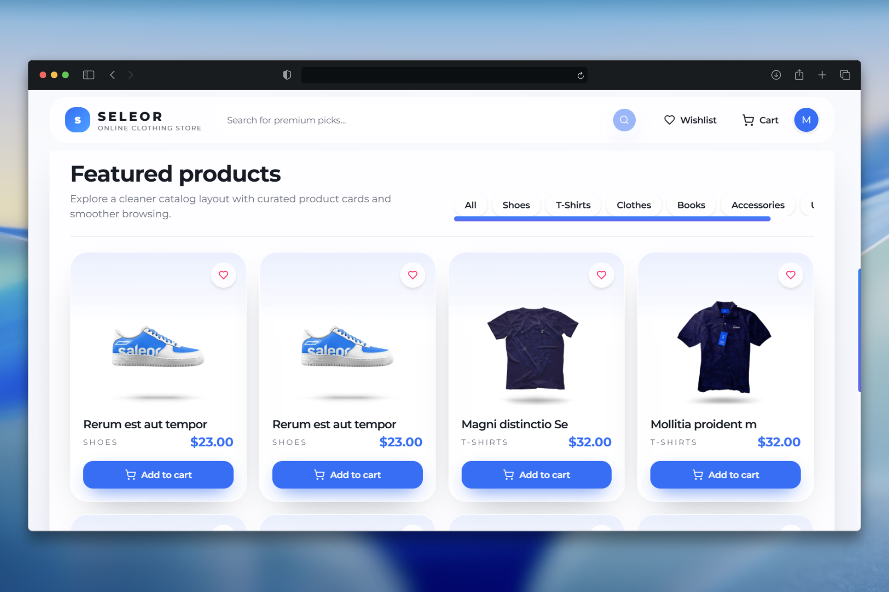
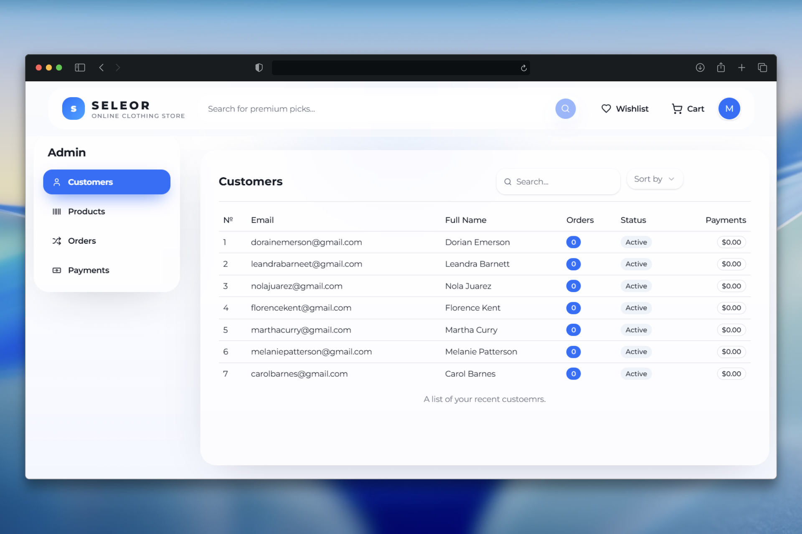

# 🛒 E-commerce Platform

This project is a fully functional **E-commerce platform** developed using the **MERN stack** with an emphasis on **scalability** and **modern web technologies**.

---

## 📸 Screenshots

---

## 🚀 Demo

🔗 [Live Preview](https://e-commerce.mustafoalisherovich.ru)

---

## ✨ Features

- 🛍️ **Shopping Cart** – add, update, and remove products
- 📊 **Admin Dashboard Panel** – manage products, users & orders
- 💳 **Stripe Payment Integration** – secure & reliable checkout
- ⚡ **Scalability & Performance** – optimized for growth
- 🔮 **Future Enhancements** – continuous improvements

---

## 🛠️ Tech Stack

| Technology               | Usage                      |
| ------------------------ | -------------------------- |
| ⚛️ **Next.js (React)**   | Frontend framework         |
| 🟦 **TypeScript**        | Type-safe development      |
| 🟢 **Node.js + Express** | Backend API                |
| 🍃 **MongoDB**           | NoSQL Database             |
| 💳 **Stripe**            | Global payment integration |
